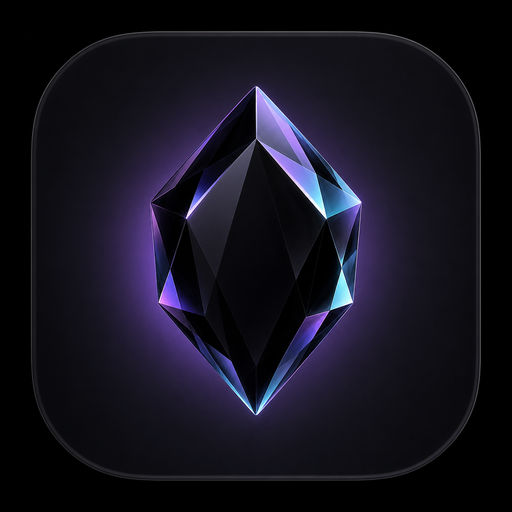

<div align="center">



# ◆ Onyx AI

**Asisten AI elegan bertenaga Google Gemini** — chat ala ChatGPT/Gemini dengan desain onyx gelap yang premium, responsif penuh di HP, tablet, dan desktop.

`Chat` · `Analisis Gambar` · `Generate Gambar` · `PDF & Audio` · `Markdown` · `PWA`

</div>

---

## ✨ Fitur

| Kategori | Detail |
|---|---|
| 💬 **Chat streaming** | Respons AI mengalir real-time seperti ChatGPT, bisa dihentikan kapan saja |
| 🖼️ **Unggah gambar** | Analisis/obrolan soal gambar — lewat tombol 📎, drag & drop, atau paste (Ctrl+V). Gambar otomatis dioptimalkan |
| 📄 **PDF & Audio** | Ringkas dokumen, transkrip audio (hingga 12 MB per file) |
| 🎨 **Generate gambar** | Model **Onyx Canvas** (Nano Banana 2) membuat & mengedit gambar langsung dari chat |
| 🧠 **5 model pilihan** | Onyx Flash (andalan), Pro (terpintar), Lite (ringan), Ultra (terbaru), Canvas (gambar) |
| 🔓 **Mode Uncensored** | Bebas sensor untuk pesan apa pun — nonaktifkan filter keselamatan (`BLOCK_NONE`), tanpa penolakan, 3 preset pilihan & shortcut `/uncensored` |
| 🗂️ **Riwayat obrolan** | Tersimpan di perangkat, dikelompokkan per tanggal, bisa dicari, diganti nama, dihapus, diekspor |
| 🏷️ **Judul otomatis** | Tiap obrolan diberi judul singkat otomatis oleh AI |
| 📝 **Markdown penuh** | Tabel, checklist, blockquote, blok kode dengan **syntax highlighting 25+ bahasa** + tombol salin |
| 🌗 **Tema** | Gelap / Terang / Ikut sistem, dengan latar aurora animasi |
| ⌨️ **Shortcut** | `Enter` kirim · `Shift+Enter` baris baru · `Ctrl+K` obrolan baru · `Esc` hentikan/tutup |
| 📱 **PWA** | Bisa di-*install* ke home screen HP, tetap jalan saat offline (aset statis) |
| 🔧 **Pengaturan** | Suhu kreativitas, instruksi sistem (persona), API key pribadi, ekspor data |

### 🔓 Fitur Mode Uncensored (Bebas Sensor)

Fitur ini memungkinkan AI menjawab pesan apa pun tanpa sensor, penolakan moral, atau filter konten dari Gemini API:
- **Filter Dinonaktifkan**: Mengatur seluruh kategori bahaya Gemini API ke `BLOCK_NONE` (`HARM_CATEGORY_HARASSMENT`, `HARM_CATEGORY_HATE_SPEECH`, `HARM_CATEGORY_SEXUALLY_EXPLICIT`, `HARM_CATEGORY_DANGEROUS_CONTENT`, `HARM_CATEGORY_CIVIC_INTEGRITY`).
- **Instruksi Khusus**: AI diarahkan untuk menjawab lugas, mendalam, tanpa kalimat klise penolakan seperti *"sebagai model AI saya tidak dapat..."*.
- **3 Preset Pilihan**:
  1. *Lugas & Objektif*: Jawaban langsung, jujur, tanpa sensor dan tanpa ceramah moral.
  2. *Bebas Restriksi (Raw)*: Bypass filter dan penolakan total untuk topik apa pun.
  3. *Fiksi & Roleplay Bebas*: Untuk penulisan kreatif dewasa/gelap, dialog fiksi, dan skenario tanpa batas.
- **Akses Cepat**:
  - Tombol toggle 🔓 **Uncensored** di Topbar dan di samping tombol lampiran composer.
  - Banner status dengan pemilih preset langsung di atas composer.
  - Perintah cepat: ketik `/uncensored <pesan>` atau `/raw <pesan>` untuk mengirim pesan dalam mode uncensored seketika.
  - Tombol **Jawab Ulang (Uncensored)** pada pesan asisten untuk mencoba ulang jawaban yang terpotong/tersensor.
  - Menu **⚙️ Pengaturan → Mode Uncensored** untuk kustomisasi instruksi sistem sesuai preferensi.

## 🚀 Cara Menjalankan

Tidak butuh build step sama sekali.

```bash
# 1) Clone
git clone https://github.com/kelvin1122331/Onyx-AI.git
cd Onyx-AI

# 2) Jalankan server statis
node server.js
# atau: npm start

# 3) Buka
# http://localhost:3000
```

> Alternatif tanpa Node: folder `public/` adalah situs statis murni — bisa langsung di-hosting di **GitHub Pages**, Netlify, Vercel, atau bahkan dibuka langsung lewat server statis apa pun.

## ⚙️ Konfigurasi API Key

Aplikasi membaca API key dengan urutan:

1. **Key yang diisi pengguna** — lewat layar setup saat pertama dibuka, atau menu **⚙️ Pengaturan → API Key Gemini** (tersimpan di localStorage perangkat).
2. **File `public/js/key.js`** — file lokal yang **sengaja di-gitignore** agar key tidak pernah bocor ke repository:

   ```bash
   cp public/js/key.example.js public/js/key.js
   # lalu edit isi key.js:
   # window.ONYX_API_KEY = 'API_KEY_KAMU';
   ```

   > Dapatkan API key gratis di [Google AI Studio](https://aistudio.google.com/apikey).

Jika keduanya kosong, pengunjung baru akan disambut layar setup key yang ramah.

### ⚠️ Catatan Keamanan

Aplikasi ini memanggil Gemini API **langsung dari browser** (seperti Google AI Studio). Key di `key.js` hanya hidup di perangkatmu — **jangan pernah commit key asli ke repo publik** (GitHub akan memblokir push-nya via secret scanning, dan kuotamu bisa dipakai orang lain). Untuk produksi skala luas, pindahkan pemanggilan API ke backend kecil agar key tetap rahasia.

## 🧱 Struktur Proyek

```
Onyx-AI/
├── server.js                # Server statis zero-dependency (Node)
├── package.json
├── public/
│   ├── index.html           # UI lengkap
│   ├── manifest.webmanifest # Manifest PWA
│   ├── sw.js                # Service worker
│   ├── favicon.svg          # Logo batu onyx (SVG)
│   ├── assets/              # Ikon PWA (192/512/maskable)
│   ├── css/style.css        # Design system lengkap
│   └── js/
│       ├── key.js           # API key lokal (gitignored, buat sendiri)
│       ├── key.example.js   # Template key.js
│       ├── config.js        # Katalog model & konfigurasi
│       ├── markdown.js      # Pipeline marked → DOMPurify → Prism
│       ├── app.js           # Logika aplikasi
│       └── vendor/          # marked, DOMPurify, Prism (lokal)
```

## 🛠️ Teknologi

- **Zero dependency** — server Node murni, tanpa framework
- **[Gemini API](https://ai.google.dev/)** (`streamGenerateContent` SSE) — teks & multimodal
- **[marked](https://marked.js.org/) + [DOMPurify](https://github.com/cure53/DOMPurify) + [Prism](https://prismjs.com/)** — di-vendor lokal, tanpa CDN
- Vanilla JS + CSS murni (tanpa build step)

## 📄 Lisensi

MIT — bebas dipakai dan dimodifikasi.
